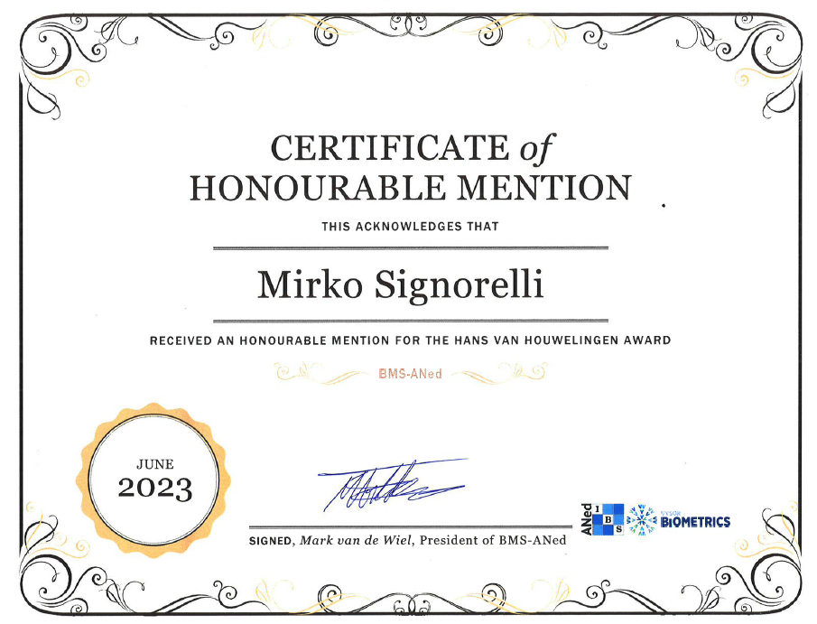
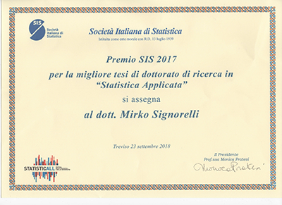

### VIDI grant (NWO - Dutch Research Council)

In October 2024, I was awarded a **VIDI grant** from NWO (Dutch Research Council). This is a personal grant that can be used to appoint scientific staff who performs research related to a 5-years long research project proposed and led by the applicant.

My project focuses on the development of **new statistical methods and software** for the **dynamic prediction** of survival outcomes in settings with numerous longitudinal predictors.

### e-Science Center Fellowship

In June 2023, I was awarded an **eScience Center Fellowship** from the Netherlands eScience Center. The [Fellowship Programme](https://www.esciencecenter.nl/fellowship-programme) aims to raise awareness on the importance of properly developing and maintaining research software, and tries to increase recognition and rewards around it.

My fellowship project aims to improve the efficiency, accessibility and visibility of the `R` package `pencal`. To find more about `pencal`, see the [`R` packages](r.html) page.

### Honourable mention from the jury of the Hans van Houwelingen Award (BMS-ANed)

In June 2023, I received a **honourable mention from the jury of the Hans van Houwelingen Award** for my article [Poisson-Tweedie mixed-effects model: a flexible approach for the analysis of longitudinal RNA-seq data](https://journals.sagepub.com/doi/10.1177/1471082X20936017) that is published in *Statistical Modelling*.

The Hans van Houwelingen Award Biometry Award from the [BMS-ANed](https://www.vvsor.nl/biometrics/) (Biometrics section of the Dutch Society for Statistics and Operations Research, as well as Dutch section of the International Biometric Society) is awarded every two years to a publication that has contributed significantly to the development or application of biometry. 

### Young Statistician Award (International Biometric Society)

In August 2020, I received the [**Young Statistician Award of the International Biometric Society**](https://www.vvsor.nl/biometrics/news/two-awards-for-bms-aned-members-at-ibc2020) (IBS).

This award was based on a world-wide competition whereby young statisticians could submit a short paper with a contribution to be presented at the 30th International Biometric Conference (IBC2020). Five winners, one for each macroregion of IBS, were selected. My short paper, entitled "How to predict a survival outcome using longitudinal and high-dimensional omics data", was the winner for Europe. Its contents were presented during the [Young Statistician Showcase session of IBC2020](https://www.ibc2020.org/scientific-programme/showcases).

### Best PhD Thesis Award (Italian Statistical Society)

In June 2018, I received the **Best PhD Thesis Award of the Italian Statistical Society**. 

This award is awarded every other year to PhD theses belonging to one of the following categories: methological statistics, applied statistics and demography. My PhD thesis, entitled ["Inferring Community-driven Structure in Complex Networks"](https://www.researchgate.net/publication/322746472_Inferring_Community-driven_Structure_in_Complex_Networks), was selected for the award in the applied statistics category.

After I received the award, I was interviewed by the Italian newspaper *Corriere della Sera*; [you can read the interview (in Italian) here](https://bergamo.corriere.it/notizie/cronaca/18_ottobre_05/da-chiuduno-all-olanda-premiato-la-ricerca-statistica-politica-8bce14cc-c87b-11e8-81ab-863c582a99f0.shtml).

### Best Student Paper Award (Statistical Modelling Society)

In July 2017, I received the [**Best Student Paper Toyota Corporation Award of the Statistical Modelling Society**](https://journals.sagepub.com/doi/full/10.1177/1471082X17726638).

This award was based on a competition between all short papers submitted by PhD students for a contributed talk at the 32nd International Workshop on Statistical Modelling (IWSM).

### Research Award 2016 (Dept. of Statistics, University of Padova)

In 2017, I received the **Research Award 2016 of the Department of Statistical Sciences of the University of Padova**.

This award is based on a competition whereby all junior researchers affiliated to the Department of Statistical Sciences can submit one of their published articles for consideration. I received the award based on my article [NEAT: an efficient network enrichment analysis test](https://bmcbioinformatics.biomedcentral.com/articles/10.1186/s12859-016-1203-6) that is published in BMC Bioinformatics.

<!-- the part below is a fix to the menu not displaying properly
on the mobile version -->

