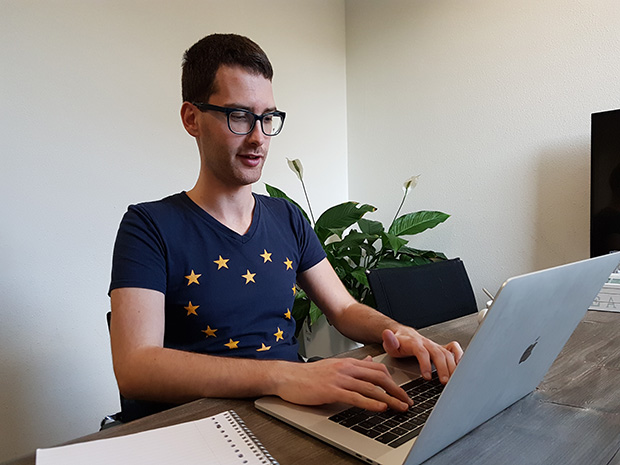

##

## Mirko Signorelli

#### ASSISTANT PROFESSOR IN STATISTICAL SCIENCE

Mathematical Institute  
Leiden University  
Niels Bohrweg 1, 2333 CA Leiden (NL)  
Office: room 221

Welcome! My name is **Mirko Signorelli**, and I work as **assistant professor in Statistical Science** at Leiden University. In this website you can find information about my research and work.

### Short bio

I currently work as **assistant professor in Statistical Science** at the [Mathematical Institute](https://www.universiteitleiden.nl/en/science/mathematics) of [Leiden University](https://www.universiteitleiden.nl/en/about-us), where I do research and teach courses for the [Master in Statistics and Data Science](https://www.universiteitleiden.nl/en/education/study-programmes/master/statistics--data-science) and the [Bachelor in Wiskunde (Mathematics)](https://www.universiteitleiden.nl/onderwijs/opleidingen/bachelor/wiskunde).

I received a **double PhD in Statistics** from the [University of Groningen](https://www.rug.nl) and from the [University of Padova](https://www.unipd.it/en/) in 2017. After that, I worked as postdoctoral researcher at the [Department of Biomedical Data Sciences](https://www.lumc.nl/org/bds/?setlanguage=English&setcountry=en) (section of Medical Statistics) of the [Leiden University Medical Center](https://www.lumc.nl/research/introduction).

### Research interests

My [research work](publications.html) deals both with the development of new statistical methods, and with applied research questions.

My methodological research is centered on the **development of new statistical models** for the analysis of **dependent data** and **high-dimensional data**, focusing in particular on **longitudinal data**, **survival data**, and **complex networks**. 

As concerns applied research, I have mostly worked on **applications of statistics to biomedical problems and to social network analysis**. In particular, I have worked with a [team of biologists, doctors and neurologists](https://www.spierziektencentrum.nl/location/lumc/), on the analysis of a variety of **clinical and omic data** on muscular dystrophies, with a particular focus on the identification of prognostic biomarkers for Duchenne muscular dystrophy.

</section>
