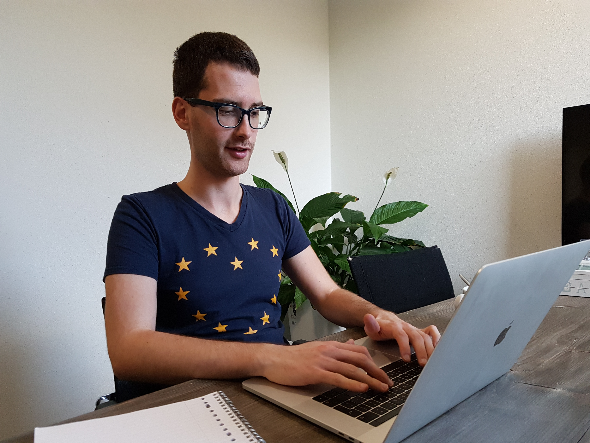

##

## Mirko Signorelli

#### STATISTICIAN AND R PROGRAMMER

Section of Medical Statistics  
Department of Biomedical Data Sciences  
Leiden University Medical Center  
Einthovenweg 20, 2333 ZC Leiden (NL)  
Office: S5-10

### Introduction

Welcome! My name is **Mirko Signorelli**, I am a **(bio)statistician and R programmer**. In this website you can find information about my research and work.

### Short bio

I currently work as **postdoctoral researcher in biostatistics** at the [Department of Biomedical Data Sciences](https://www.lumc.nl/org/bds/?setlanguage=English&setcountry=en) (section of Medical Statistics) of the [Leiden University Medical Center](https://www.lumc.nl/research/introduction).

I received a **double PhD in Statistics** from the [University of Groningen](https://www.rug.nl) and from the [University of Padova](https://www.unipd.it/en/) in 2017. I wrote my PhD dissertation, entitled "Inferring Community-driven Structure in Complex Networks", under the supervision of Professors [Ernst Wit](https://www.math.rug.nl/~ernst/) and [Monica Chiogna](https://www.unibo.it/sitoweb/monica.chiogna2/en).

Over the years, I worked on different projects, both methodological and applied. You can find out more about them by checking out my [publications](publications.html) and my [R packages](r.html).

### Research interests

My research is centered on the **development of new statistical models** for the analysis of **dependent data**, focusing in particular on **statistical modelling of networks** and on the **longitudinal analysis of omics and biomedical data**. I also work together with a [team of biologists, doctors and neurologists](https://www.spierziektencentrum.nl/location/lumc/), analysing a variety of **clinical and omics data on muscular dystrophies**, with a particular focus on the identification of prognostic biomarkers for Duchenne muscular dystrophy.

More broadly, I am interested in:

* biostatistics, statistical genetics and bioinformatics;

* generalized, linear, and mixed models;

* variable selection, penalized and high dimensional inference;

* statistical network science;

* survival analysis;

* model-based clustering;

* applications of statistics in life and social sciences.

</section>
